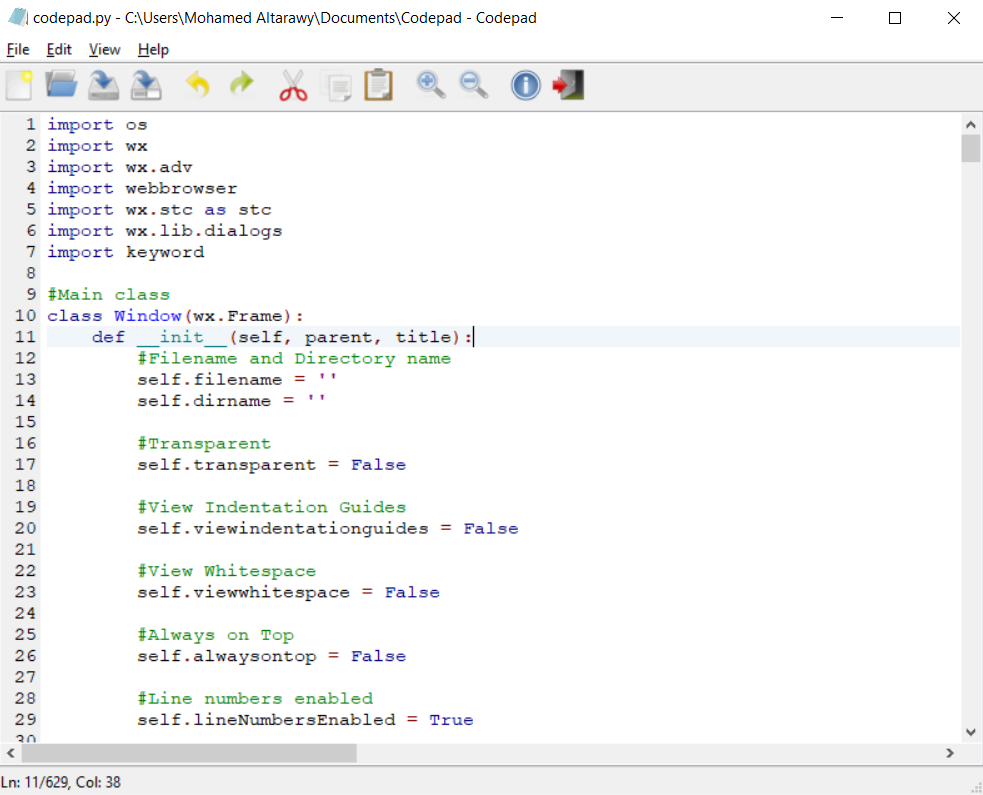

	

## What is Pythopad?

Pythopad is a free Python source code editor and Notepad replacement for Windows

## Features

Pythopad allows all the typical features of a text and code editor packed into a tiny and fast application:

- Toolbar
- Wide array of view options
- Syntax highlighting support for Python
- Usable accelerator keys (Ctrl+N, Ctrl+O, etc.)
- Zoom in and zoom out
- Newline ending

## Pythopad Release Information
- **Name:** Pythopad
- **Version:** BETA
- **Author:** Mohamed Altarawy
- **Release Date:** 4/16/2019
